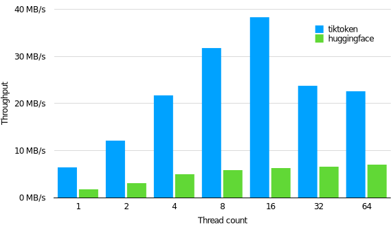

# ⏳ tiktoken

tiktoken is a fast [BPE](https://en.wikipedia.org/wiki/Byte_pair_encoding) tokeniser for use with
OpenAI's models.

```python
import tiktoken
enc = tiktoken.get_encoding("gpt2")
assert enc.decode(enc.encode("hello world")) == "hello world"
```

The open source version of `tiktoken` can be installed from PyPI:
```
pip install tiktoken
```

The tokeniser API is documented in `tiktoken/core.py`.

Example code using `tiktoken` can be found in the [OpenAI Cookbook](https://github.com/openai/openai-cookbook/blob/main/examples/How_to_count_tokens_with_tiktoken.ipynb).

## Performance

`tiktoken` is between 3-6x faster than a comparable open source tokeniser:



Performance measured on 1GB of text using the GPT-2 tokeniser, using `GPT2TokenizerFast` from
`tokenizers==0.13.2` and `transformers==4.24.0`.


